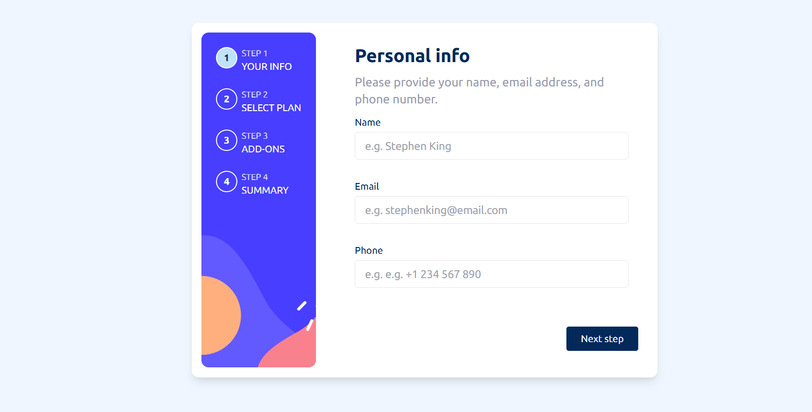

# 🎯 Frontend Mentor - Multi-step Form Solution

This is my solution to the [Multi-step form challenge on Frontend Mentor](https://www.frontendmentor.io/challenges/multistep-form-YVAnSdqQBJ). It's a responsive, user-friendly form that guides users through multiple steps of input and selection with built-in validation and summary before final confirmation.

---

## 📑 Table of Contents

- [Overview](#overview)

  - [The Challenge](#the-challenge)
  - [Screenshot](#screenshot)
  - [Links](#links)

- [My Process](#my-process)

  - [Built With](#built-with)
  - [What I Learned](#what-i-learned)
  - [Continued Development](#continued-development)
  - [Useful Resources](#useful-resources)

- [Author](#author)

---

## 📌 Overview

### The Challenge

Users should be able to:

- Navigate through each step of the form
- Return to previous steps and edit their inputs
- See a summary of their selections before confirming
- Experience responsive design across mobile and desktop devices
- View hover and focus states on interactive elements
- Receive validation messages when:

  - A required field is left empty
  - Email format is incorrect
  - No selection is made before continuing

### Screenshot



---

### Links

- 💡 **Solution URL:** [View Code on GitHub](https://github.com/Boyutife/Multi-step-form-2025)
- 🌐 **Live Site URL:** [Visit Live Site](https://your-live-site-url.com)

---

## 🛠 My Process

### Built With

- Semantic HTML5
- CSS Grid & Flexbox
- Mobile-first responsive design
- **React** (with Hooks)
- **Vite** (or Create React App, depending on your setup)
- Tailwind CSS (if used)
- Functional component architecture

---

### What I Learned

While building this project, I practiced:

- Managing multi-step form logic with React state
- Creating reusable, stateful components (like `StepFooter`, `Summary`, `ThankYou`)
- Handling validation and conditional rendering
- Organizing UI logic in a modular, scalable way

Here's an example of a conditional render pattern I used:

```jsx
{
  isConfirmed ? <ThankYou /> : <FinishingUp />;
}
```

And an example of a validation function:

```js
if (!emailRegex.test(formData.email)) {
  errors.email = 'Please enter a valid email address';
}
```

---

### Continued Development

I’d like to explore:

- Form libraries like React Hook Form or Formik
- Integrating local storage or Redux for persistent state
- Adding animations between steps (e.g. Framer Motion)
- Accessibility improvements (keyboard navigation, ARIA roles)

---

### Useful Resources

- [React Docs – State and Lifecycle](https://reactjs.org/docs/state-and-lifecycle.html)
- [Frontend Mentor Discord](https://discord.gg/frontendmentor)
- [CSS Tricks – A Complete Guide to Flexbox](https://css-tricks.com/snippets/css/a-guide-to-flexbox/)
- [Vite](https://vitejs.dev/) – Fast development build tool

---

## 👤 Author

- Portfolio – [yourwebsite.com](https://www.frontendmentor.io/home/my-challenges?tab=completed)
- Frontend Mentor – [@Boyutife](https://www.frontendmentor.io/profile/Boyutife)
- Twitter – [@Boluwatife_ven](https://twitter.com/Boluwatife_ven)
